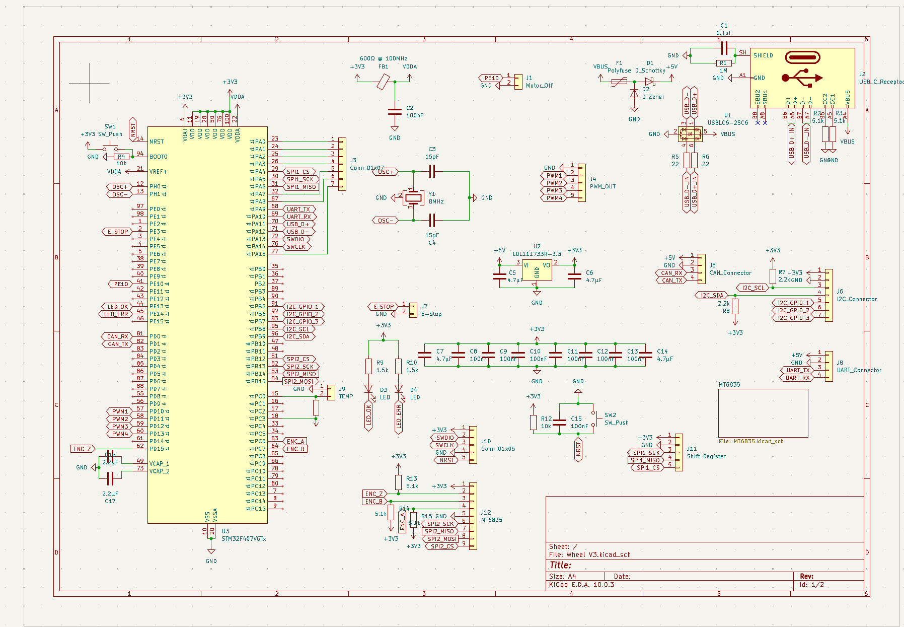
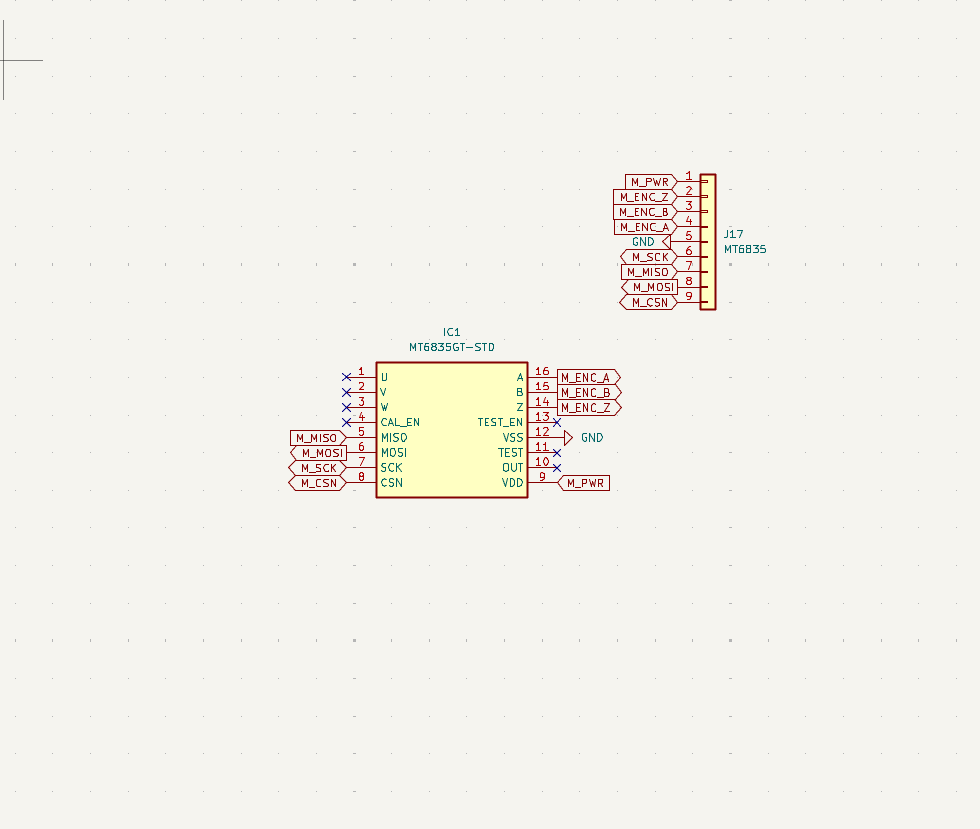
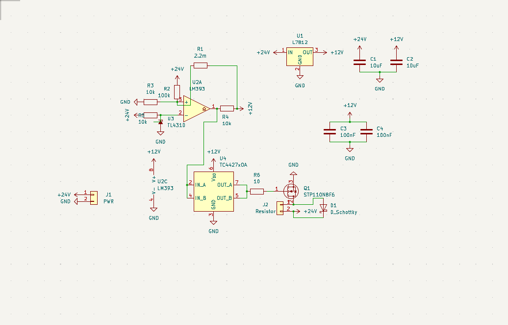
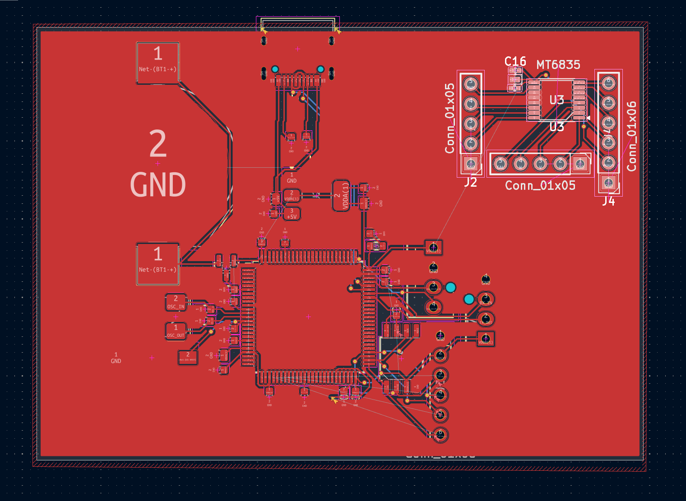
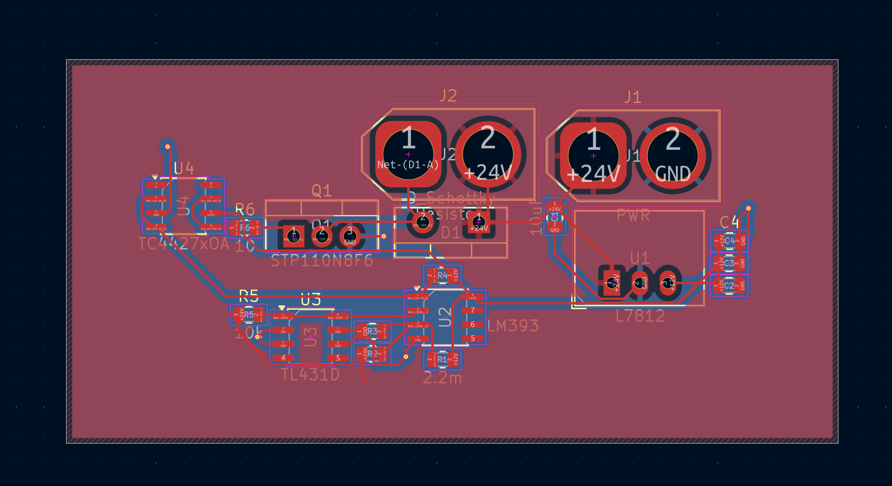
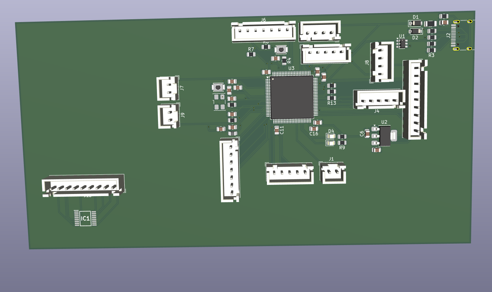
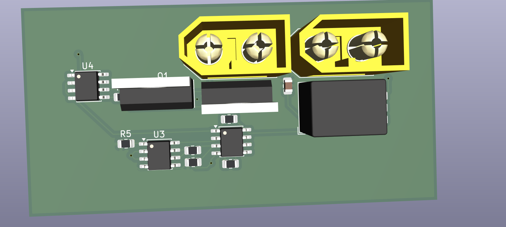

# Wheel
An STM32F407VGT6 based microcontroller board designed for use with the OpenFFBoard firmware.
This is made to be used as a controller for a hoverboard hub motor. That way you can use the hoverboard for direct drive sim racing.

## Setup
This controller will be flashed with the OpenFFBoard firmware over the dedicated ST-Link port. It is the unlabeled 1 x 5 connector. I will then flash the hoverboard with: . This will then allow me to use the hoverboard as a regular BLDC motor thus allowing me to create a fully working sim wheel.

## Design

This is a picture of the full schematic:

This is a picture of the board for the MT6835 magnetic encoder:

This is a picture of the board for the Brake Chopper:

This is a picture of the full PCB:

This is a picture of the Brake Chopper PCB:

This is a picture of the expected product, but missing a few footprints:

This is a picture of the expected Brake Chopper:
